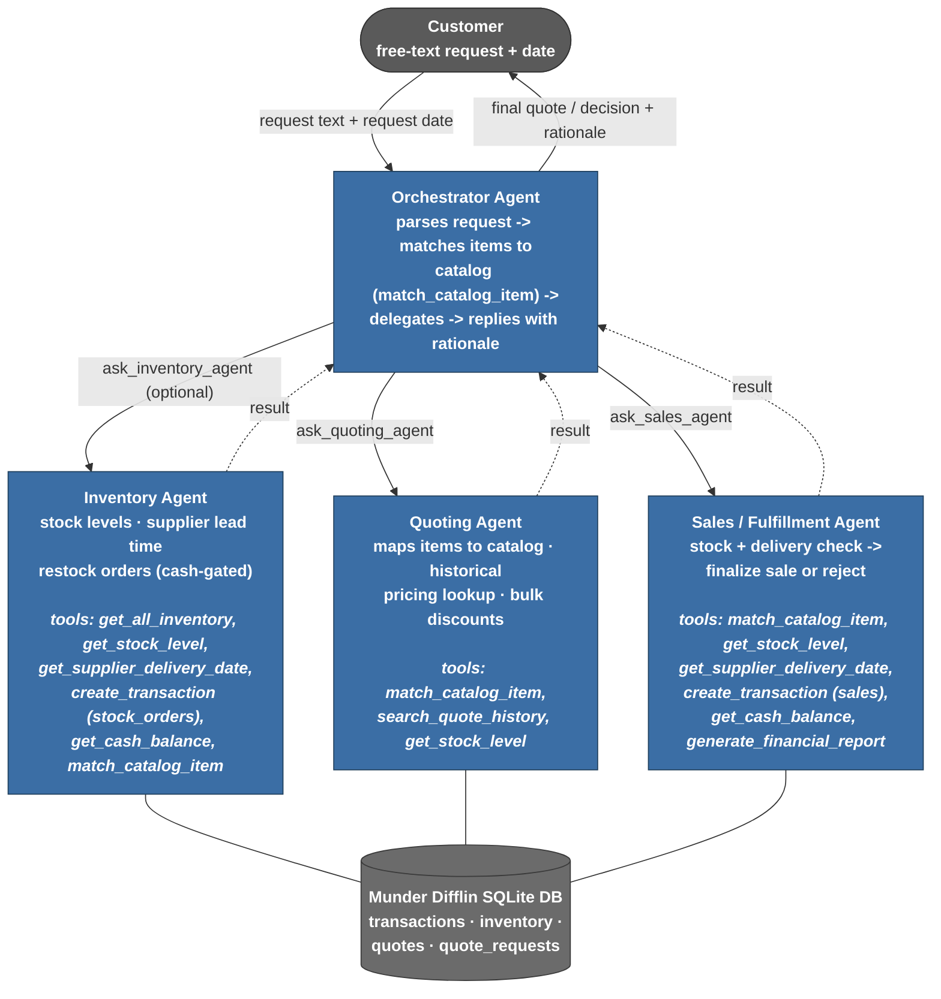
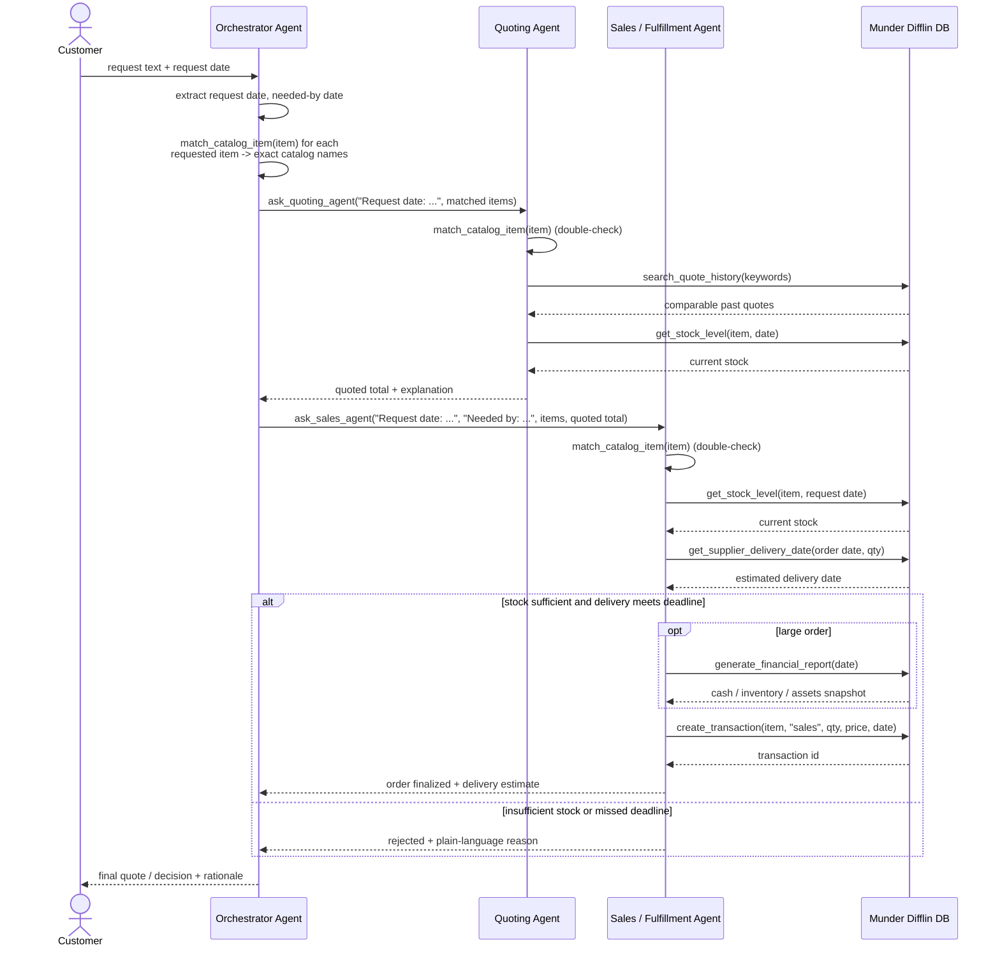

# Beaver's Choice Paper Company — Multi-Agent Workflow

Mermaid source for the two workflow diagrams (rendered to `workflow_diagram.png` and
`sequence_diagram.png` via `mermaid-cli`, which is the image deliverable). Framework:
`smolagents` `ToolCallingAgent` x4, model `gpt-4o-mini` via the OpenAI-compatible
Vocareum proxy.

## 1. Architecture diagram (`workflow_diagram.png`)

Shows all four agents, their tool bindings (and which starter-code helper function each
tool wraps), and the data flow between agents, the customer, and the database.

**Tool bindings (helper function → agent):**

| Helper function (starter code) | Agent(s) using it |
| --- | --- |
| `get_all_inventory` | Inventory Agent |
| `get_stock_level` | Inventory Agent, Quoting Agent, Sales Agent |
| `get_supplier_delivery_date` | Inventory Agent, Sales Agent |
| `create_transaction` | Inventory Agent (`stock_orders`), Sales Agent (`sales`) |
| `get_cash_balance` | Inventory Agent, Sales Agent |
| `generate_financial_report` | Sales Agent (pre-fulfillment health check on large orders) |
| `search_quote_history` | Quoting Agent |

All database access goes through these starter-code helper functions — no raw SQL
from agent code. `match_catalog_item` is a deterministic (non-LLM) fuzzy-matching
tool shared by the Orchestrator, Inventory Agent, Quoting Agent, and Sales Agent to
map free-text item descriptions to exact catalog names, avoiding item-name
hallucination — each agent re-validates the name itself as a safety net, and every
DB-touching tool also rejects any `item_name` that isn't an exact catalog match.

## 2. Sequence diagram (`sequence_diagram.png`)

Shows the temporal flow and data exchanged for a single customer request, including
the branch between a fulfilled order and a rejected one.

